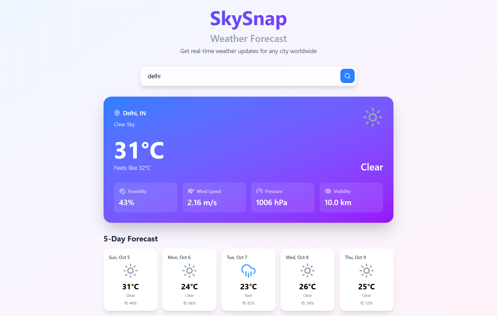

# SkySnap

SkySnap is a modern weather forecast web application built with React, TypeScript, and Vite. It provides real-time weather updates and a 5-day forecast for any city worldwide.

## 🌦️ Features

- Search for any city to get current weather and 5-day forecast
- Beautiful, responsive UI with Tailwind CSS
- Weather icons and detailed weather metrics
- Error handling and loading states


## 🖼️ Preview




## 🚀 Tech Stack

- **React** (with Hooks)
- **TypeScript**
- **Vite** (for fast development and build)
- **Tailwind CSS** (utility-first styling)
- **Lucide React** (icon library)
- **OpenWeatherMap API** (weather data)

## 📁 Project Structure

```
.
├── .gitignore
├── eslint.config.js
├── index.html
├── package.json
├── README.md
├── tsconfig.app.json
├── tsconfig.json
├── tsconfig.node.json
├── vite.config.ts
├── public/
│   └── vite.svg
└── src/
    ├── App.css
    ├── App.tsx
    ├── index.css
    ├── main.tsx
    ├── assets/
    │   └── react.svg
    ├── components/
    │   ├── ErrorDisplay.tsx
    │   ├── ForecastDisplay.tsx
    │   ├── SearchBar.tsx
    │   ├── WeatherDisplay.tsx
    │   └── WeatherIcon.tsx
    ├── pages/
    │   └── HomePage.tsx
    ├── services/
    │   └── weatherApi.ts
    └── types/
        └── weather.types.ts
```

## 🛠️ Getting Started

### Prerequisites

- [Node.js](https://nodejs.org/) (v18 or higher recommended)
- [npm](https://www.npmjs.com/) or [yarn](https://yarnpkg.com/)

### Installation

1. **Clone the repository:**
   ```sh
   git clone https://github.com/your-username/skysnap.git
   cd skysnap
   ```

2. **Install dependencies:**
   ```sh
   npm install
   # or
   yarn install
   ```

### Running the Project

To start the development server:

```sh
npm run dev
# or
yarn dev
```

Open [http://localhost:5173](http://localhost:5173) in your browser to view the app.
